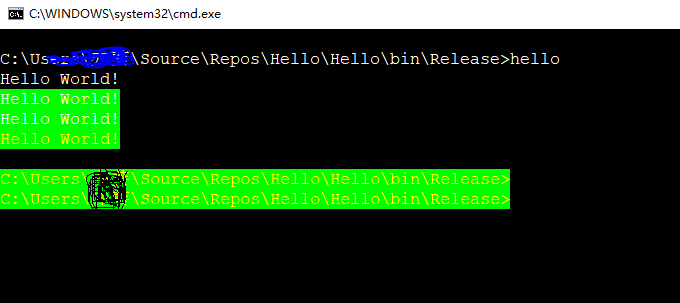

# Hello.2019CsDotNet
The source code is a Hello World for C# and .Net Course.
The code has a bug：after executing hello.exe, it returns a changed background & foreground color.
Somthing like this 

## Homework: Do as much as you can! Deadline Mar.5  2019 

1. Install Visual studio 2017
2. Register a github account and setup the repository.
3. Clone or download this code to your local PC.
4. Revise the code and make the screen return to the original color after its execution.
5. Add your source code to Source control. This will create a local repository in your PC.
   It may need to install Git & Github extension for Visual Studio.
6. Commit/Push or synchronize(同步) the revised code to your github repository in Visual Studio 2017.
7. Try to use [markdown language](https://github.com/adam-p/markdown-here/wiki/Markdown-Cheatsheet)
   to write a "Readme.md" document which illustrates the work you have done.
